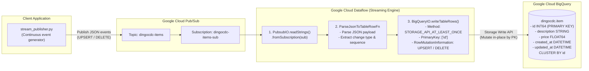
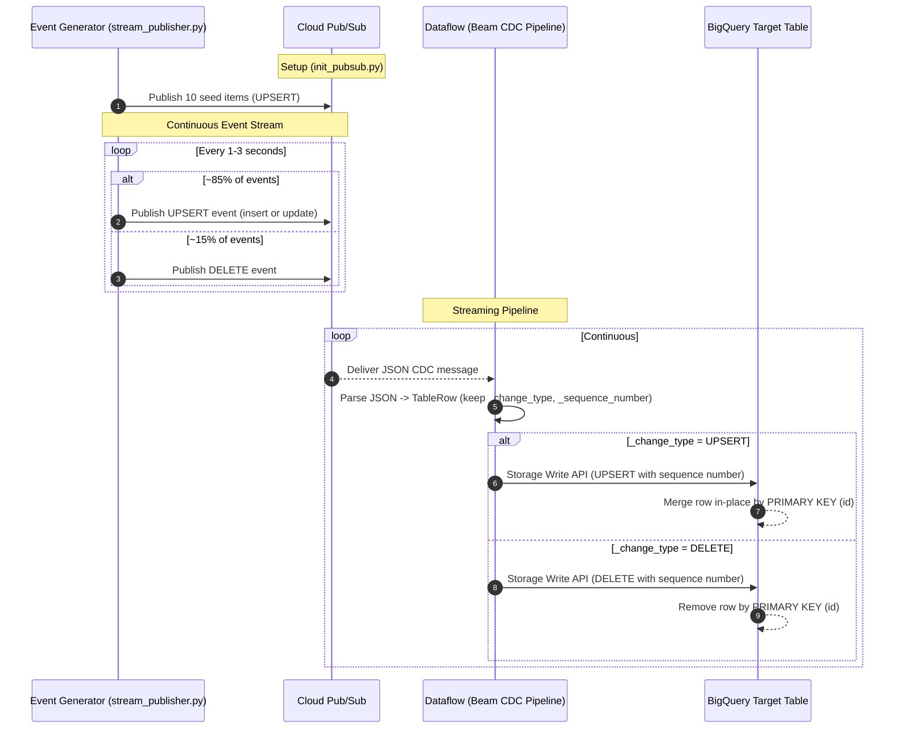

# BigQuery CDC Demo - Pub/Sub to BigQuery

[](https://github.com/cloudymoma/bqcdc/actions/workflows/build.yml?query=branch%3Apubsub)

English | [中文](README_cn.md)

A complete demonstration of Change Data Capture (CDC) from Google Cloud Pub/Sub to BigQuery using Apache Beam on Google Cloud Dataflow, with true **UPSERT** and **DELETE** semantics via the BigQuery Storage Write API.

## Architecture & How It Works

### Data Pipeline Flow



### CDC Processing Sequence



The pipeline consumes CDC events from a Pub/Sub subscription and applies them to BigQuery in-place using the Storage Write API with `RowMutationInformation` — `UPSERT` events insert or update rows by primary key, and `DELETE` events remove them. The `_sequence_number` (millisecond epoch) guarantees deterministic ordering of mutations per key.

For details on BigQuery CDC and Dataflow integration, see:
- [BigQuery Change Data Capture (CDC) Official Documentation](https://docs.cloud.google.com/bigquery/docs/change-data-capture)
- [Google Cloud Blog: Using BigQuery's new CDC capability in Dataflow](https://cloud.google.com/blog/products/data-analytics/using-bigquerys-new-cdc-capability-in-dataflow)

> **NOTE**: Unlike timestamp-polling approaches, this event-driven design supports the full set of CDC operations — including **DELETE** — because each change is explicitly described in the message envelope. This is the same pattern used by binlog-based CDC sources (e.g. Debezium, Google Datastream) that publish change events to a message bus.

## Message Envelope

CDC events are JSON messages carrying the payload plus two metadata fields:

```json
{
  "id": 1,
  "description": "Mechanical Keyboard",
  "price": 129.99,
  "created_at": "2026-09-01 10:00:00",
  "updated_at": "2026-09-01 10:15:30",
  "_change_type": "UPSERT",
  "_sequence_number": 1788257730000
}
```

| Field | Description |
|-------|-------------|
| `_change_type` | `"UPSERT"` or `"DELETE"` (defaults to `UPSERT` if missing) |
| `_sequence_number` | Millisecond epoch timestamp used for deterministic mutation ordering per primary key |

## Components

| Component | Description |
|-----------|-------------|
| **Pub/Sub** | Event stream carrying CDC messages (topic + subscription) |
| **Dataflow Pipeline** | Java/Apache Beam streaming pipeline for CDC processing (see [Dataflow CDC Blog Post](https://cloud.google.com/blog/products/data-analytics/using-bigquerys-new-cdc-capability-in-dataflow)) |
| **BigQuery** | Destination data warehouse with native CDC support (see [BigQuery CDC Docs](https://docs.cloud.google.com/bigquery/docs/change-data-capture)) |

## Prerequisites

Before starting, ensure you have:

1. **Google Cloud SDK** installed and configured
   ```bash
   gcloud --version
   ```

2. **Java 11+** and **Maven 3.6+** for Dataflow pipeline
   ```bash
   java -version
   mvn -version
   ```

3. **Python 3.8+** for Pub/Sub and BigQuery scripts
   ```bash
   python3 --version
   ```

4. **GCP Project** with the following APIs enabled:
   - Pub/Sub API
   - BigQuery API
   - Dataflow API
   - Compute Engine API

5. **Service Account** with appropriate permissions:
   - Pub/Sub Admin
   - BigQuery Admin
   - Dataflow Admin
   - Storage Admin

## Quick Start

### Step 1: Clone and Configure

```bash
# Navigate to project directory
cd bqcdc

# Review and edit configuration (optional)
# Default values work out of the box
cat conf.yml
```

### Step 2: Setup Environment

```bash
# Create virtual environment and install dependencies
make setup

# Or if you prefer to install dependencies globally
make install_deps
```

### Step 3: Initialize Pub/Sub

```bash
# Create topic, subscription, and publish seed events
make init_pubsub
```

**What this does:**
- Creates the `dingocdc-items` topic (idempotent)
- Creates the `dingocdc-items-sub` subscription (idempotent)
- Publishes 10 initial seed items as `UPSERT` events

### Step 4: Initialize BigQuery

```bash
# Create BigQuery dataset and table
make init_bq
```

**What this does:**
- Creates `dingocdc` dataset
- Creates `item` table with `PRIMARY KEY (id) NOT ENFORCED` and `CLUSTER BY id`

### Step 5: Build Dataflow Pipeline

```bash
# Build the Java pipeline JAR
make build_dataflow
```

### Step 6: Start the CDC Pipeline

Open **Terminal 1** - Start the Dataflow job:
```bash
make run_cdc
```

### Step 7: Generate CDC Events

Open **Terminal 2** - Start the streaming event generator:
```bash
make stream_pubsub
```

This publishes a mix of `UPSERT` (~85%) and `DELETE` (~15%) events every 1-3 seconds until you press Ctrl+C.

### Step 8: Verify in BigQuery

```bash
# Query the BigQuery table to see synced data
bq query --project_id=du-hast-mich --use_legacy_sql=false \
  "SELECT * FROM dingocdc.item ORDER BY updated_at DESC LIMIT 10"
```

Or use the BigQuery Console in GCP. You should see rows appear, change price, and disappear as UPSERT/DELETE events flow through.

## Configuration Reference

Edit `conf.yml` to customize:

```yaml
gcp:
  project_id: "du-hast-mich"          # Your GCP project ID
  region: "us-central1"                # GCP region
  service_account_path: "~/workspace/google/sa.json"

pubsub:
  topic_name: "dingocdc-items"         # Pub/Sub topic
  subscription_name: "dingocdc-items-sub"  # Pub/Sub subscription
  ack_deadline_seconds: 60             # Ack deadline
  message_retention_duration: "604800s" # 7 days retention
  retain_acked_messages: false

bigquery:
  dataset: "dingocdc"                  # BigQuery dataset
  table_name: "item"                   # BigQuery table
  location: "US"                       # Dataset location

dataflow:
  job_name: "dingo-pubsub-cdc"         # Dataflow job name
  num_workers: 1                       # Initial number of workers
  max_workers: 2                       # Maximum number of workers
  machine_type: "e2-medium"            # Worker machine type

generator:
  interval_min_seconds: 1.0            # Min delay between events
  interval_max_seconds: 3.0            # Max delay between events
  delete_ratio: 0.15                   # Fraction of DELETE events
  initial_items_count: 10              # Seed items on init
```

### Event Generator Configuration Options

| Option | Default | Description |
|--------|---------|-------------|
| `interval_min_seconds` | 1.0 | Minimum delay between published events |
| `interval_max_seconds` | 3.0 | Maximum delay between published events |
| `delete_ratio` | 0.15 | Fraction of events that are DELETEs (rest are UPSERTs) |
| `initial_items_count` | 10 | Number of seed items published by `init_pubsub` |

## Make Targets

| Target | Description |
|--------|-------------|
| `make help` | Show all available commands |
| `make setup` | Create virtual env and install dependencies |
| `make init_pubsub` | Create Pub/Sub topic & subscription, seed data |
| `make stream_pubsub` | Start continuous CDC event generator |
| `make init_bq` | Create BigQuery dataset and table |
| `make test` | Run Dataflow pipeline unit tests |
| `make build_dataflow` | Build Dataflow pipeline JAR |
| `make run_cdc` | Launch Dataflow CDC job |
| `make status` | Show status of all components |
| `make cleanup_pubsub` | Delete Pub/Sub topic & subscription |
| `make cleanup_bq` | Delete BigQuery dataset |
| `make cleanup_dataflow` | Cancel running Dataflow jobs |
| `make cleanup_all` | Delete all GCP resources |

### Custom Python Path

To use a custom Python interpreter, set the `PYTHON3` variable:

```bash
# Use a specific Python version
make PYTHON3=/usr/bin/python3.11 setup

# Use pyenv Python
make PYTHON3=~/.pyenv/shims/python3 init_pubsub

# Use conda Python
make PYTHON3=/opt/conda/bin/python3 init_bq
```

## Table Schema

| Column | Type | Description |
|--------|------|-------------|
| `id` | INT64 | Primary key |
| `description` | STRING | Item description |
| `price` | FLOAT64 | Item price (randomly updated) |
| `created_at` | DATETIME | Record creation timestamp |
| `updated_at` | DATETIME | Last update timestamp |

## Project Structure

```
bqcdc/
├── conf.yml                    # Configuration file
├── Makefile                    # Build and run automation
├── README.md                   # This file
├── .gitignore                  # Git ignore rules
│
├── pubsub/                     # Pub/Sub-related scripts
│   ├── init_pubsub.py          # Create topic/subscription + seed events
│   ├── stream_publisher.py     # Continuous CDC event generator
│   └── requirements.txt        # Python dependencies
│
├── bigquery/                   # BigQuery-related scripts
│   ├── init_bq.py              # Initialize BigQuery
│   └── requirements.txt        # Python dependencies
│
└── dataflow/                   # Dataflow pipeline (Java/Maven)
    ├── pom.xml                 # Maven configuration
    ├── src/main/java/com/bindiego/cdc/
    │   ├── CdcPipeline.java            # Streaming CDC pipeline (UPSERT/DELETE)
    │   └── CdcPipelineOptions.java     # Pipeline options interface
    └── src/test/java/com/bindiego/cdc/
        ├── CdcPipelineTest.java        # Pipeline unit tests
        └── CdcPipelineOptionsTest.java # Options unit tests
```

## CDC Pipeline Logic

The pipeline is a straightforward 3-stage streaming job:

1. **Read**: `PubsubIO.readStrings().fromSubscription(...)` continuously pulls JSON CDC messages.
2. **Parse**: `ParseJsonToTableRowFn` converts each JSON message into a BigQuery `TableRow`, preserving the `_change_type` and `_sequence_number` metadata. Malformed messages are logged and dropped.
3. **Write**: `BigQueryIO.writeTableRows()` with:
   - `STORAGE_API_AT_LEAST_ONCE` — low-latency Storage Write API method compatible with CDC
   - `withPrimaryKey(["id"])` — declares the mutation key
   - `withRowMutationInformationFn(...)` — maps each row to `UPSERT` or `DELETE` with its sequence number
   - `ignoreUnknownValues()` — the CDC metadata fields are not part of the target schema

### Important Notes

1. **BigQuery CDC with UPSERT and DELETE**: This pipeline uses BigQuery's native CDC feature with the Storage Write API. `RowMutationInformation` with `MutationType.UPSERT` updates rows in-place by primary key, and `MutationType.DELETE` removes them.

2. **Primary Key Required**: The BigQuery table must have a PRIMARY KEY constraint on the `id` column. The `init_bq.py` script creates the table with `PRIMARY KEY (id) NOT ENFORCED`.

3. **Sequence Numbers**: BigQuery applies mutations for the same key in sequence-number order. The generator uses millisecond epoch timestamps, so later events always win regardless of delivery order.

4. **At-Least-Once Delivery**: Pub/Sub and `STORAGE_API_AT_LEAST_ONCE` may deliver duplicates. This is safe here because CDC mutations are idempotent per (key, sequence number).

## Troubleshooting

### Pub/Sub Issues

```bash
# Check topic exists
gcloud pubsub topics describe dingocdc-items

# Check subscription exists and its backlog
gcloud pubsub subscriptions describe dingocdc-items-sub

# Pull a few messages manually (without acking)
gcloud pubsub subscriptions pull dingocdc-items-sub --limit=5
```

### BigQuery Issues

```bash
# List datasets
bq ls --project_id=du-hast-mich

# Describe table
bq show du-hast-mich:dingocdc.item
```

### Dataflow Issues

```bash
# List running jobs
gcloud dataflow jobs list --region=us-central1 --filter="state:Running"

# View job logs
gcloud dataflow jobs show JOB_ID --region=us-central1
```

## Cleanup

To remove all GCP resources created by this demo:

```bash
# Cancel Dataflow jobs, delete BigQuery dataset, Pub/Sub topic & subscription
make cleanup_all
```

Or individually:
```bash
make cleanup_dataflow  # Cancel Dataflow jobs
make cleanup_bq        # Delete BigQuery dataset
make cleanup_pubsub    # Delete Pub/Sub topic & subscription
```

## Cost Considerations

This demo uses minimal resources:
- **Pub/Sub**: Pay per message volume (negligible at demo rates)
- **Dataflow**: 1-2x `e2-medium` workers with Streaming Engine (pay per use)
- **BigQuery**: Pay per query/storage

**Recommendation**: Run `make cleanup_all` when done to avoid charges.

## Technical Requirements

### Dataflow Pipeline Dependencies

| Dependency | Version | Notes |
|------------|---------|-------|
| Apache Beam | 2.75.0 | Core streaming framework |
| google-auth-library | 1.34.0+ | Required for mTLS support (CertificateSourceUnavailableException) |
| Jackson | 2.18.x | JSON message parsing |
| Java | 11+ | Runtime requirement |

### Key Features Used

- **Streaming Engine**: Enabled via `--experiments=enable_streaming_engine` for better resource utilization
- **Storage Write API**: Uses `STORAGE_API_AT_LEAST_ONCE` method for CDC writes
- **Pub/Sub IO**: Native Beam streaming source with automatic acking
- **CDC with Primary Key**: BigQuery table uses `PRIMARY KEY (id) NOT ENFORCED` for UPSERT/DELETE semantics

## References & Documentation

- [BigQuery Change Data Capture (CDC) Official Documentation](https://docs.cloud.google.com/bigquery/docs/change-data-capture)
- [Using BigQuery's new CDC capability in Dataflow (Google Cloud Blog)](https://cloud.google.com/blog/products/data-analytics/using-bigquerys-new-cdc-capability-in-dataflow)
- [Apache Beam BigQueryIO Documentation](https://beam.apache.org/documentation/io/built-in/google-bigquery/)
- [Apache Beam PubsubIO Documentation](https://beam.apache.org/releases/javadoc/current/org/apache/beam/sdk/io/gcp/pubsub/PubsubIO.html)
