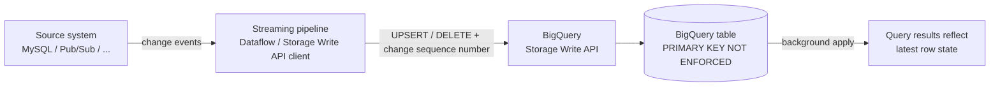

# BigQuery Change Data Capture (CDC)

[中文文档](README_cn.md)

This repository demonstrates **BigQuery Change Data Capture (CDC)** — streaming row-level
changes (inserts, updates, deletes) from a source system into BigQuery in near real time,
using the BigQuery **Storage Write API**.

The `main` branch is documentation only. The runnable demos live in dedicated branches:

| Branch | Source | Change types | Highlights |
|--------|--------|--------------|------------|
| [`mysql`](../../tree/mysql) | MySQL (polling via JDBC) | UPSERT | Dataflow polls a MySQL table on a watermark column and upserts rows into BigQuery |
| [`pubsub`](../../tree/pubsub) | Pub/Sub (streaming) | UPSERT + DELETE | True event-driven CDC: JSON change events carry `_change_type` and `_sequence_number` metadata, applied to BigQuery with full delete support |

## What is BigQuery CDC?

Traditionally, keeping a BigQuery table in sync with a mutable source table meant loading
change records into a staging table and periodically running `MERGE` statements — extra
cost, extra latency, and extra orchestration.

BigQuery CDC removes that step. The **Storage Write API** lets you stream *mutations*
instead of plain appends: each record is tagged as an **UPSERT** (insert or replace the row
with the same primary key) or a **DELETE** (remove the row with that primary key). BigQuery
applies these changes to the base table for you in the background — no staging tables, no
scheduled `MERGE` jobs.

## How it works



The key ingredients:

1. **A primary key on the target table.** BigQuery uses it to match incoming mutations to
   existing rows. It must be declared `NOT ENFORCED`, and the table should be clustered by
   the key columns:

   ```sql
   CREATE TABLE demo_ds.items (
     id INT64 NOT NULL,
     description STRING,
     price FLOAT64,
     updated_at DATETIME,
     PRIMARY KEY (id) NOT ENFORCED
   )
   CLUSTER BY id;
   ```

2. **Change type per record.** Each streamed record carries a pseudocolumn
   `_CHANGE_TYPE` of `UPSERT` or `DELETE`. (When writing from Apache Beam / Dataflow, this
   is expressed via `RowMutationInformation` on `BigQueryIO`.)

3. **Change ordering.** An optional `_CHANGE_SEQUENCE_NUMBER` lets BigQuery resolve
   out-of-order or duplicate deliveries deterministically: for the same primary key, the
   record with the highest sequence number wins. This is what makes at-least-once
   streaming safe for CDC.

4. **Managed apply with tunable freshness.** BigQuery applies the mutations to the base
   table in the background. The table's `max_staleness` option controls the trade-off
   between query cost and result freshness — queries either read fully merged data or
   tolerate a bounded staleness window.

## Demo branches

### [`pubsub` branch](../../tree/pubsub) — Pub/Sub → Dataflow → BigQuery

An event generator publishes JSON change events (~85% UPSERT / ~15% DELETE) to a Pub/Sub
topic. A streaming Dataflow (Apache Beam) pipeline reads the subscription and applies the
mutations to BigQuery via `STORAGE_API_AT_LEAST_ONCE` with `RowMutationInformation` —
demonstrating full CDC semantics including deletes, with per-key ordering from the event's
`_sequence_number`.

### [`mysql` branch](../../tree/mysql) — MySQL → Dataflow → BigQuery

A Dataflow pipeline periodically polls a MySQL table via JDBC using an `updated_at`
watermark and upserts changed rows into BigQuery. Simpler to set up (no message bus), but
polling cannot observe deletes — a good illustration of why event-driven CDC (the
`pubsub` branch) is the more complete pattern.

Each branch has its own README with step-by-step setup, a `Makefile` that automates
everything (`make help`), and cleanup targets to tear down all GCP resources.

## Official documentation

- [Change data capture in BigQuery](https://cloud.google.com/bigquery/docs/change-data-capture) — CDC concepts, `_CHANGE_TYPE`, `_CHANGE_SEQUENCE_NUMBER`, `max_staleness`
- [BigQuery Storage Write API](https://cloud.google.com/bigquery/docs/write-api) — the streaming ingestion API underneath
- [Primary key and foreign key constraints](https://cloud.google.com/bigquery/docs/information-schema-table-constraints) — `NOT ENFORCED` constraints used by CDC
- [Apache Beam BigQueryIO](https://beam.apache.org/documentation/io/built-in/google-bigquery/) — the Dataflow connector used by both demos
- [Datastream](https://cloud.google.com/datastream/docs) — Google Cloud's fully managed CDC service, if you'd rather not build the pipeline yourself
