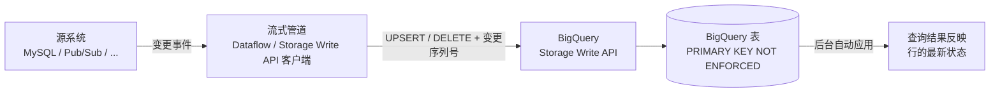

# BigQuery 变更数据捕获（CDC）

[English](README.md)

本仓库演示 **BigQuery 变更数据捕获（Change Data Capture, CDC）** —— 利用 BigQuery
**Storage Write API**，将源系统的行级变更（插入、更新、删除）以近实时的方式同步到 BigQuery。

`main` 分支仅包含文档，可运行的演示项目位于各自的分支中：

| 分支 | 数据源 | 变更类型 | 特点 |
|------|--------|----------|------|
| [`mysql`](../../tree/mysql) | MySQL（JDBC 轮询） | UPSERT | Dataflow 基于水位列轮询 MySQL 表，并将变更行 upsert 到 BigQuery |
| [`pubsub`](../../tree/pubsub) | Pub/Sub（流式） | UPSERT + DELETE | 真正的事件驱动 CDC：JSON 变更事件携带 `_change_type` 和 `_sequence_number` 元数据，完整支持删除操作 |

## 什么是 BigQuery CDC？

传统上，要让 BigQuery 表与可变的源表保持同步，需要先把变更记录加载到暂存表，再定期执行
`MERGE` 语句 —— 这意味着额外的成本、额外的延迟和额外的调度工作。

BigQuery CDC 省去了这一步。**Storage Write API** 允许你直接流式写入*变更（mutation）*，
而不仅仅是追加数据：每条记录都被标记为 **UPSERT**（插入或替换相同主键的行）或
**DELETE**（删除该主键对应的行）。BigQuery 会在后台自动将这些变更应用到基表 ——
无需暂存表，也无需定时的 `MERGE` 作业。

## 工作原理



关键要素：

1. **目标表必须定义主键。** BigQuery 依靠主键将传入的变更匹配到已有的行。主键必须声明为
   `NOT ENFORCED`，且建议按主键列对表进行聚簇：

   ```sql
   CREATE TABLE demo_ds.items (
     id INT64 NOT NULL,
     description STRING,
     price FLOAT64,
     updated_at DATETIME,
     PRIMARY KEY (id) NOT ENFORCED
   )
   CLUSTER BY id;
   ```

2. **每条记录携带变更类型。** 每条流式写入的记录都包含伪列 `_CHANGE_TYPE`，取值为
   `UPSERT` 或 `DELETE`。（在 Apache Beam / Dataflow 中，通过 `BigQueryIO` 的
   `RowMutationInformation` 来表达。）

3. **变更排序。** 可选的 `_CHANGE_SEQUENCE_NUMBER` 让 BigQuery 能够确定性地处理乱序或
   重复投递：对于同一主键，序列号最大的记录胜出。正是这一机制使得 at-least-once
   流式写入对 CDC 来说是安全的。

4. **托管应用与可调的新鲜度。** BigQuery 在后台将变更应用到基表。表的 `max_staleness`
   选项控制查询成本与结果新鲜度之间的权衡 —— 查询要么读取完全合并后的数据，要么容忍一个
   有界的过期窗口。

## 演示分支

### [`pubsub` 分支](../../tree/pubsub) —— Pub/Sub → Dataflow → BigQuery

事件生成器向 Pub/Sub 主题发布 JSON 变更事件（约 85% UPSERT / 15% DELETE）。流式
Dataflow（Apache Beam）管道读取订阅，并通过 `STORAGE_API_AT_LEAST_ONCE` 结合
`RowMutationInformation` 将变更应用到 BigQuery —— 演示包含删除操作在内的完整 CDC 语义，
并利用事件中的 `_sequence_number` 保证按键排序。

### [`mysql` 分支](../../tree/mysql) —— MySQL → Dataflow → BigQuery

Dataflow 管道通过 JDBC 基于 `updated_at` 水位列定期轮询 MySQL 表，并将变更行 upsert 到
BigQuery。搭建更简单（无需消息总线），但轮询方式无法感知删除操作 —— 这也正好说明了为什么
事件驱动的 CDC（`pubsub` 分支）是更完整的模式。

每个分支都有各自的 README（含分步搭建指南）、自动化一切操作的 `Makefile`（`make help`），
以及清理所有 GCP 资源的清理目标。

## 官方文档

- [BigQuery 变更数据捕获](https://cloud.google.com/bigquery/docs/change-data-capture) —— CDC 概念、`_CHANGE_TYPE`、`_CHANGE_SEQUENCE_NUMBER`、`max_staleness`
- [BigQuery Storage Write API](https://cloud.google.com/bigquery/docs/write-api) —— 底层的流式写入 API
- [主键与外键约束](https://cloud.google.com/bigquery/docs/information-schema-table-constraints) —— CDC 所依赖的 `NOT ENFORCED` 约束
- [Apache Beam BigQueryIO](https://beam.apache.org/documentation/io/built-in/google-bigquery/) —— 两个演示都使用的 Dataflow 连接器
- [Datastream](https://cloud.google.com/datastream/docs) —— Google Cloud 全托管的 CDC 服务，适合不想自建管道的场景
