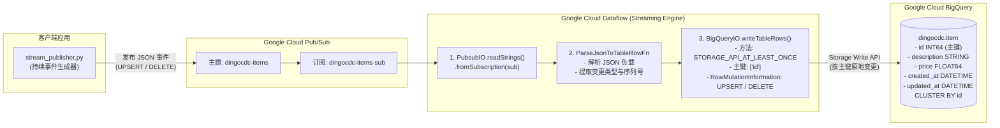
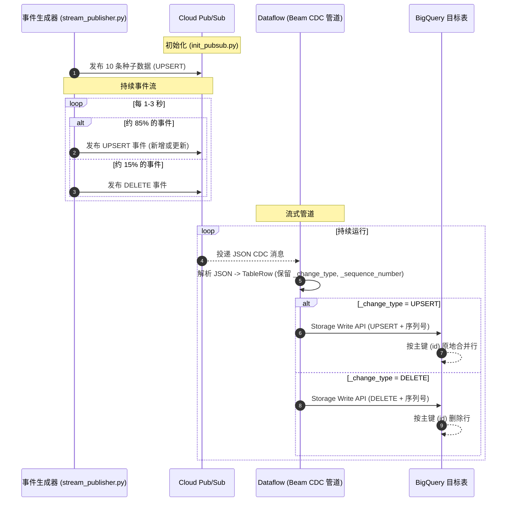

# BigQuery CDC 演示 - Pub/Sub 到 BigQuery

[](https://github.com/cloudymoma/bqcdc/actions/workflows/build.yml)

[English](README.md) | 中文

一个完整的变更数据捕获(CDC)演示项目:使用 Apache Beam 在 Google Cloud Dataflow 上运行流式管道,将 Google Cloud Pub/Sub 中的事件流实时同步到 BigQuery,并通过 BigQuery Storage Write API 实现真正的 **UPSERT** 与 **DELETE** 原地变更语义。

## 架构与工作原理

### 数据管道流程



### CDC 处理时序



管道从 Pub/Sub 订阅消费 CDC 事件,并通过 Storage Write API 的 `RowMutationInformation` 将变更原地应用到 BigQuery — `UPSERT` 事件按主键新增或更新行,`DELETE` 事件按主键删除行。`_sequence_number`(毫秒级时间戳)保证同一主键上变更的确定性顺序。

关于 BigQuery CDC 与 Dataflow 集成的详细信息,请参考:
- [BigQuery 变更数据捕获 (CDC) 官方文档](https://docs.cloud.google.com/bigquery/docs/change-data-capture)
- [Google Cloud 博客: 在 Dataflow 中使用 BigQuery 的全新 CDC 能力](https://cloud.google.com/blog/products/data-analytics/using-bigquerys-new-cdc-capability-in-dataflow)

> **说明**: 与基于时间戳轮询的方案不同,这种事件驱动设计支持完整的 CDC 操作 — 包括 **DELETE** — 因为每条消息都显式描述了变更内容。这与基于 binlog 的 CDC 方案(如 Debezium、Google Datastream)将变更事件发布到消息总线的模式完全一致。

## 消息格式

CDC 事件为 JSON 消息,包含数据负载和两个元数据字段:

```json
{
  "id": 1,
  "description": "Mechanical Keyboard",
  "price": 129.99,
  "created_at": "2026-09-01 10:00:00",
  "updated_at": "2026-09-01 10:15:30",
  "_change_type": "UPSERT",
  "_sequence_number": 1788257730000
}
```

| 字段 | 说明 |
|------|------|
| `_change_type` | `"UPSERT"` 或 `"DELETE"`(缺省默认为 `UPSERT`) |
| `_sequence_number` | 毫秒级时间戳,用于保证同一主键上变更的确定性顺序 |

## 组件

| 组件 | 说明 |
|------|------|
| **Pub/Sub** | 承载 CDC 消息的事件流(主题 + 订阅) |
| **Dataflow 管道** | Java/Apache Beam 流式 CDC 处理管道(参考 [Dataflow CDC 博客](https://cloud.google.com/blog/products/data-analytics/using-bigquerys-new-cdc-capability-in-dataflow)) |
| **BigQuery** | 支持原生 CDC 的目标数据仓库(参考 [BigQuery CDC 文档](https://docs.cloud.google.com/bigquery/docs/change-data-capture)) |

## 前置条件

开始之前,请确保你已具备:

1. **Google Cloud SDK** 已安装并配置
   ```bash
   gcloud --version
   ```

2. **Java 11+** 和 **Maven 3.6+**(用于 Dataflow 管道)
   ```bash
   java -version
   mvn -version
   ```

3. **Python 3.8+**(用于 Pub/Sub 和 BigQuery 脚本)
   ```bash
   python3 --version
   ```

4. **GCP 项目**,并启用以下 API:
   - Pub/Sub API
   - BigQuery API
   - Dataflow API
   - Compute Engine API

5. **服务账号**,具备以下权限:
   - Pub/Sub Admin
   - BigQuery Admin
   - Dataflow Admin
   - Storage Admin

## 快速开始

### 第 1 步: 克隆并配置

```bash
# 进入项目目录
cd bqcdc

# 查看并按需修改配置(可选)
# 默认配置开箱即用
cat conf.yml
```

### 第 2 步: 准备环境

```bash
# 创建虚拟环境并安装依赖
make setup

# 或者全局安装依赖
make install_deps
```

### 第 3 步: 初始化 Pub/Sub

```bash
# 创建主题、订阅并发布种子数据
make init_pubsub
```

**该命令会:**
- 创建 `dingocdc-items` 主题(幂等)
- 创建 `dingocdc-items-sub` 订阅(幂等)
- 以 `UPSERT` 事件形式发布 10 条初始种子数据

### 第 4 步: 初始化 BigQuery

```bash
# 创建 BigQuery 数据集和表
make init_bq
```

**该命令会:**
- 创建 `dingocdc` 数据集
- 创建带 `PRIMARY KEY (id) NOT ENFORCED` 和 `CLUSTER BY id` 的 `item` 表

### 第 5 步: 构建 Dataflow 管道

```bash
# 构建 Java 管道 JAR
make build_dataflow
```

### 第 6 步: 启动 CDC 管道

打开 **终端 1** - 启动 Dataflow 作业:
```bash
make run_cdc
```

### 第 7 步: 生成 CDC 事件

打开 **终端 2** - 启动流式事件生成器:
```bash
make stream_pubsub
```

生成器每 1-3 秒发布一条事件,其中约 85% 为 `UPSERT`、约 15% 为 `DELETE`,按 Ctrl+C 停止。

### 第 8 步: 在 BigQuery 中验证

```bash
# 查询 BigQuery 表,查看同步数据
bq query --project_id=du-hast-mich --use_legacy_sql=false \
  "SELECT * FROM dingocdc.item ORDER BY updated_at DESC LIMIT 10"
```

也可以使用 GCP 控制台中的 BigQuery Console。随着 UPSERT/DELETE 事件流入,你会看到行的新增、价格变化和删除。

## 配置说明

编辑 `conf.yml` 自定义配置:

```yaml
gcp:
  project_id: "du-hast-mich"          # 你的 GCP 项目 ID
  region: "us-central1"                # GCP 区域
  service_account_path: "~/workspace/google/sa.json"

pubsub:
  topic_name: "dingocdc-items"         # Pub/Sub 主题
  subscription_name: "dingocdc-items-sub"  # Pub/Sub 订阅
  ack_deadline_seconds: 60             # Ack 截止时间
  message_retention_duration: "604800s" # 消息保留 7 天
  retain_acked_messages: false

bigquery:
  dataset: "dingocdc"                  # BigQuery 数据集
  table_name: "item"                   # BigQuery 表
  location: "US"                       # 数据集位置

dataflow:
  job_name: "dingo-pubsub-cdc"         # Dataflow 作业名
  num_workers: 1                       # 初始 worker 数
  max_workers: 2                       # 最大 worker 数
  machine_type: "e2-medium"            # Worker 机型

generator:
  interval_min_seconds: 1.0            # 事件间最小间隔
  interval_max_seconds: 3.0            # 事件间最大间隔
  delete_ratio: 0.15                   # DELETE 事件占比
  initial_items_count: 10              # 初始化种子数据条数
```

### 事件生成器配置项

| 配置项 | 默认值 | 说明 |
|--------|--------|------|
| `interval_min_seconds` | 1.0 | 事件发布的最小间隔 |
| `interval_max_seconds` | 3.0 | 事件发布的最大间隔 |
| `delete_ratio` | 0.15 | DELETE 事件占比(其余为 UPSERT) |
| `initial_items_count` | 10 | `init_pubsub` 发布的种子数据条数 |

## Make 命令

| 命令 | 说明 |
|------|------|
| `make help` | 显示所有可用命令 |
| `make setup` | 创建虚拟环境并安装依赖 |
| `make init_pubsub` | 创建 Pub/Sub 主题和订阅并发布种子数据 |
| `make stream_pubsub` | 启动持续 CDC 事件生成器 |
| `make init_bq` | 创建 BigQuery 数据集和表 |
| `make test` | 运行 Dataflow 管道单元测试 |
| `make build_dataflow` | 构建 Dataflow 管道 JAR |
| `make run_cdc` | 启动 Dataflow CDC 作业 |
| `make status` | 查看所有组件状态 |
| `make cleanup_pubsub` | 删除 Pub/Sub 主题和订阅 |
| `make cleanup_bq` | 删除 BigQuery 数据集 |
| `make cleanup_dataflow` | 取消运行中的 Dataflow 作业 |
| `make cleanup_all` | 删除所有 GCP 资源 |

### 自定义 Python 路径

通过 `PYTHON3` 变量指定 Python 解释器:

```bash
# 使用指定版本的 Python
make PYTHON3=/usr/bin/python3.11 setup

# 使用 pyenv 的 Python
make PYTHON3=~/.pyenv/shims/python3 init_pubsub

# 使用 conda 的 Python
make PYTHON3=/opt/conda/bin/python3 init_bq
```

## 表结构

| 列名 | 类型 | 说明 |
|------|------|------|
| `id` | INT64 | 主键 |
| `description` | STRING | 商品描述 |
| `price` | FLOAT64 | 商品价格(随机更新) |
| `created_at` | DATETIME | 记录创建时间 |
| `updated_at` | DATETIME | 最后更新时间 |

## 项目结构

```
bqcdc/
├── conf.yml                    # 配置文件
├── Makefile                    # 构建与运行自动化
├── README.md                   # 英文文档
├── README_cn.md                # 本文件
├── .gitignore                  # Git 忽略规则
│
├── pubsub/                     # Pub/Sub 相关脚本
│   ├── init_pubsub.py          # 创建主题/订阅 + 发布种子数据
│   ├── stream_publisher.py     # 持续 CDC 事件生成器
│   └── requirements.txt        # Python 依赖
│
├── bigquery/                   # BigQuery 相关脚本
│   ├── init_bq.py              # 初始化 BigQuery
│   └── requirements.txt        # Python 依赖
│
└── dataflow/                   # Dataflow 管道 (Java/Maven)
    ├── pom.xml                 # Maven 配置
    ├── src/main/java/com/bindiego/cdc/
    │   ├── CdcPipeline.java            # 流式 CDC 管道 (UPSERT/DELETE)
    │   └── CdcPipelineOptions.java     # 管道参数接口
    └── src/test/java/com/bindiego/cdc/
        ├── CdcPipelineTest.java        # 管道单元测试
        └── CdcPipelineOptionsTest.java # 参数单元测试
```

## CDC 管道逻辑

管道是一个简洁的三阶段流式作业:

1. **读取**: `PubsubIO.readStrings().fromSubscription(...)` 持续拉取 JSON CDC 消息。
2. **解析**: `ParseJsonToTableRowFn` 将每条 JSON 消息转换为 BigQuery `TableRow`,并保留 `_change_type` 和 `_sequence_number` 元数据。格式错误的消息记录日志后丢弃。
3. **写入**: `BigQueryIO.writeTableRows()` 配置:
   - `STORAGE_API_AT_LEAST_ONCE` — 低延迟且兼容 CDC 的 Storage Write API 写入方式
   - `withPrimaryKey(["id"])` — 声明变更主键
   - `withRowMutationInformationFn(...)` — 将每行映射为带序列号的 `UPSERT` 或 `DELETE`
   - `ignoreUnknownValues()` — CDC 元数据字段不属于目标表结构,写入时忽略

### 重要说明

1. **BigQuery CDC 的 UPSERT 与 DELETE**: 管道使用 BigQuery 原生 CDC 能力(Storage Write API)。`RowMutationInformation` 的 `MutationType.UPSERT` 按主键原地更新行,`MutationType.DELETE` 按主键删除行。

2. **必须有主键**: BigQuery 目标表必须在 `id` 列上定义 PRIMARY KEY 约束。`init_bq.py` 创建表时使用 `PRIMARY KEY (id) NOT ENFORCED`。

3. **序列号**: BigQuery 按序列号顺序应用同一主键上的变更。生成器使用毫秒级时间戳,因此无论投递顺序如何,较新的事件总是生效。

4. **至少一次投递**: Pub/Sub 与 `STORAGE_API_AT_LEAST_ONCE` 可能产生重复投递。由于 CDC 变更对 (主键, 序列号) 幂等,这里是安全的。

## 故障排查

### Pub/Sub 问题

```bash
# 检查主题是否存在
gcloud pubsub topics describe dingocdc-items

# 检查订阅是否存在
gcloud pubsub subscriptions describe dingocdc-items-sub

# 手动拉取几条消息查看(不 ack)
gcloud pubsub subscriptions pull dingocdc-items-sub --limit=5
```

### BigQuery 问题

```bash
# 列出数据集
bq ls --project_id=du-hast-mich

# 查看表信息
bq show du-hast-mich:dingocdc.item
```

### Dataflow 问题

```bash
# 列出运行中的作业
gcloud dataflow jobs list --region=us-central1 --filter="state:Running"

# 查看作业详情
gcloud dataflow jobs show JOB_ID --region=us-central1
```

## 清理资源

删除本演示创建的所有 GCP 资源:

```bash
# 取消 Dataflow 作业,删除 BigQuery 数据集、Pub/Sub 主题和订阅
make cleanup_all
```

或者分别执行:
```bash
make cleanup_dataflow  # 取消 Dataflow 作业
make cleanup_bq        # 删除 BigQuery 数据集
make cleanup_pubsub    # 删除 Pub/Sub 主题和订阅
```

## 成本考量

本演示使用的资源极少:
- **Pub/Sub**: 按消息量计费(演示流量下几乎可忽略)
- **Dataflow**: 1-2 台 `e2-medium` worker + Streaming Engine(按用量计费)
- **BigQuery**: 按查询/存储计费

**建议**: 完成后运行 `make cleanup_all` 避免产生费用。

## 技术要求

### Dataflow 管道依赖

| 依赖 | 版本 | 说明 |
|------|------|------|
| Apache Beam | 2.75.0 | 核心流式框架 |
| google-auth-library | 1.34.0+ | mTLS 支持所需 (CertificateSourceUnavailableException) |
| Jackson | 2.18.x | JSON 消息解析 |
| Java | 11+ | 运行时要求 |

### 使用的关键特性

- **Streaming Engine**: 通过 `--experiments=enable_streaming_engine` 启用,提升资源利用率
- **Storage Write API**: 使用 `STORAGE_API_AT_LEAST_ONCE` 方式进行 CDC 写入
- **Pub/Sub IO**: Beam 原生流式数据源,自动 ack
- **带主键的 CDC**: BigQuery 表使用 `PRIMARY KEY (id) NOT ENFORCED` 实现 UPSERT/DELETE 语义

## 参考文档

- [BigQuery 变更数据捕获 (CDC) 官方文档](https://docs.cloud.google.com/bigquery/docs/change-data-capture)
- [在 Dataflow 中使用 BigQuery 的全新 CDC 能力 (Google Cloud 博客)](https://cloud.google.com/blog/products/data-analytics/using-bigquerys-new-cdc-capability-in-dataflow)
- [Apache Beam BigQueryIO 文档](https://beam.apache.org/documentation/io/built-in/google-bigquery/)
- [Apache Beam PubsubIO 文档](https://beam.apache.org/releases/javadoc/current/org/apache/beam/sdk/io/gcp/pubsub/PubsubIO.html)
